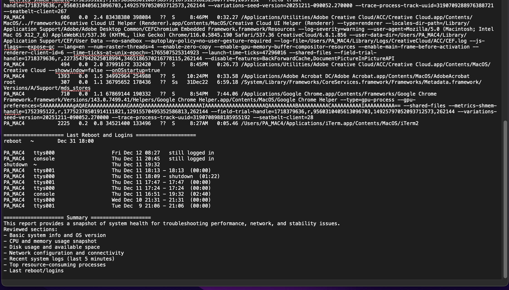

# IT-01 System Health Check (MacOs)
A macOS system health check script designed to simulate real-world **IT/Desktop Support troubleshooting**.  
The script gathers system information, performance metrics, and network diagnostics, then outputs a timestamped report for analysis.
This project demonstrates hands-on technical skills commonly used by **entry-level IT Support technicians**.

## Project Goal

To create a simple, repeatable diagnostic tool that an IT Support technician could use when a user reports:

- “My computer is slow”
- “Something feels wrong with my system”
- “My internet isn’t working properly”

The script automates common checks instead of running them manually one-by-one.

---
## What This Project Does

When executed, the script:

- Collects **basic system information**
- Captures **CPU and memory usage**
- Checks **disk space**
- Displays **network configuration**
- Performs **connectivity tests**
- Lists **top resource-consuming processes**
- Pulls **recent system log messages**
- Saves everything into a clean, timestamped report

The report is saved locally for easy review or sharing.

---
## System Requirements

- macOS
- Terminal (built-in)
- No additional software or dependencies required

---

## Screenshots

### Running the system health check and generated report

### Generated system report end

